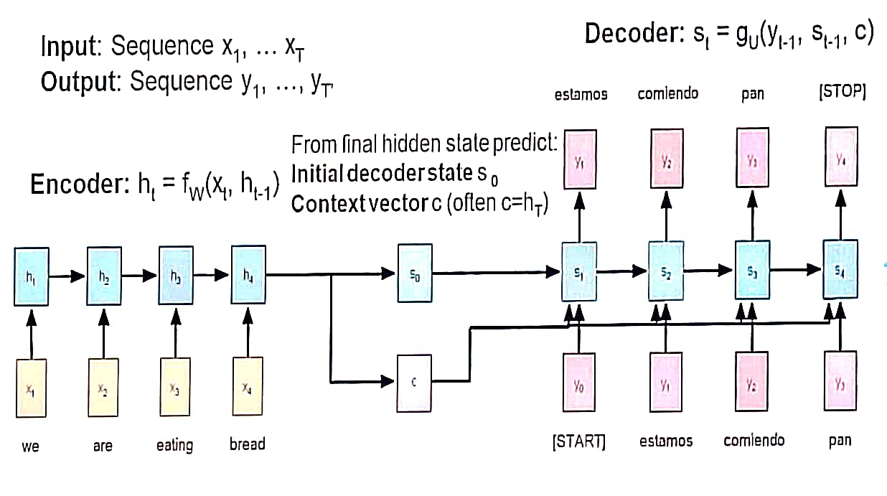
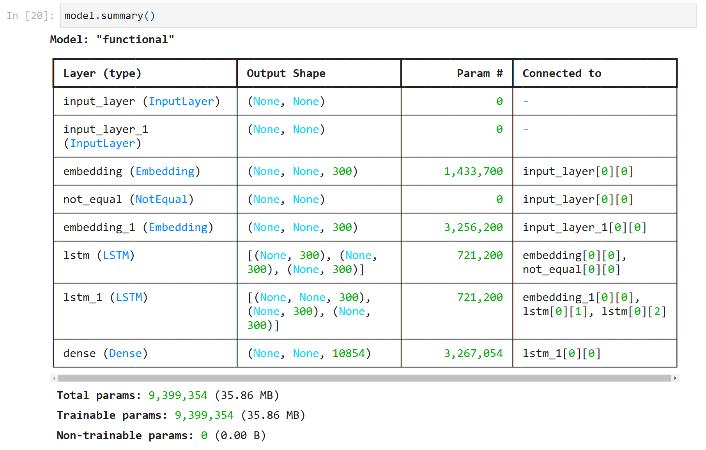
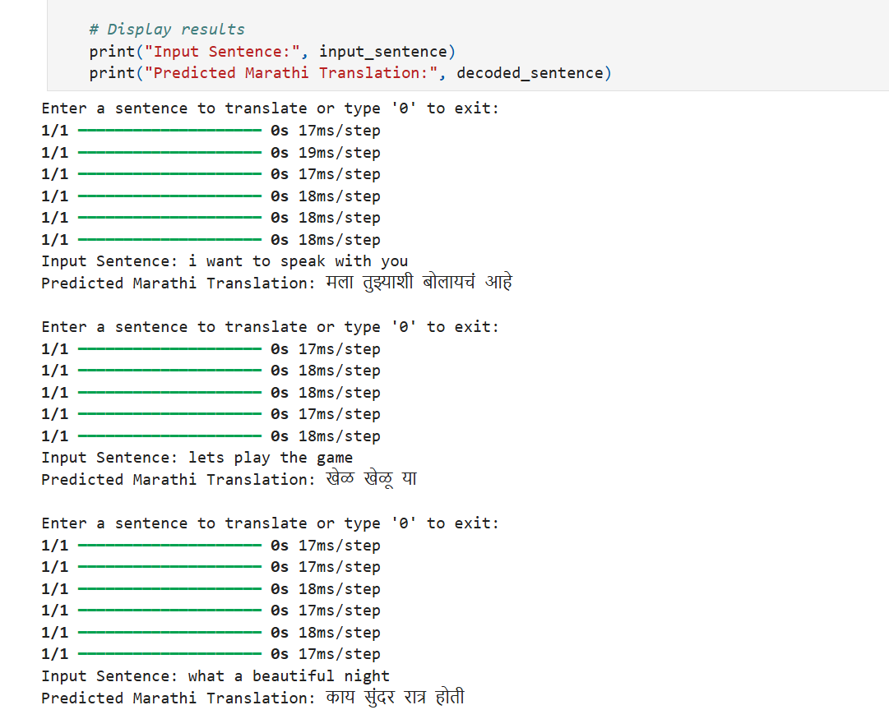

# Neural Machine Translation using Seq2Seq

### **About the Project**
This project implements a **Neural Machine Translation (NMT)** model using a Sequence-to-Sequence (Seq2Seq) architecture with LSTM layers. The model translates English sentences into Marathi, showcasing the power of deep learning in natural language processing (NLP).

---

## **Features**
- **Encoder-Decoder Architecture:** Utilizes LSTM-based encoder and decoder layers for efficient sequence learning.
- **Embeddings with Masking:** Handles padding tokens with `mask_zero=True` in embedding layers.
- **Tokenization:** Supports token-level embeddings for input and output sequences.
- **Custom Training and Inference:** Built-in decoding function to generate translations step-by-step.
- **Language Pair:** English to Marathi translation.

---

## **Project Structure**
- **`Neural-Machine-Translation.ipynb`**: Contains the entire code for data preparation, model training, and inference.
- **Screenshots:** Includes visuals of the model summary and output.

---

## **Model Architecture**



### Encoder:
- Embedding layer for input sequences.
- LSTM to encode input into context vectors (hidden and cell states).

### Decoder:
- Embedding layer for target sequences.
- LSTM unrolling step-by-step with input from previous states.
- Dense layer with softmax activation for predicting the next token.

### Model Diagram:


---

## **Output Example**
The model successfully translates English sentences into Marathi. Below is an example of the output:

| **Input (English)**      | **Output (Marathi)**       |
|--------------------------|----------------------------|
| Turn off the tv.         | टीव्ही बंद कर                |



---

## **How to Use**
### Prerequisites:
1. Python 3.x
2. Required libraries:
   - tensorFlow
   - numPy
   - scikit-learn

### Steps:
1. Clone the repository:
   ```bash
   git clone https://github.com/rushirao17/Neural-Machine-Translation-using-Seq2Seq.git
   ```
2. Open the Jupyter Notebook:
   ```bash
   jupyter notebook Neural-Machine-Translation.ipynb
   ```
3. Execute the notebook cells step by step.
4. Add your own English input sentence in the decoding function to generate translations.

---

## **Team Contribution**
- **CDAC DBDA Group 6**:
  - Model design and implementation
  - Data preprocessing and tokenization
  - Training and evaluation

---

## **Acknowledgements**
Special thanks to **CDAC DBDA** for providing the platform and resources to complete this project.

---

**Happy Translating!** 🌐
